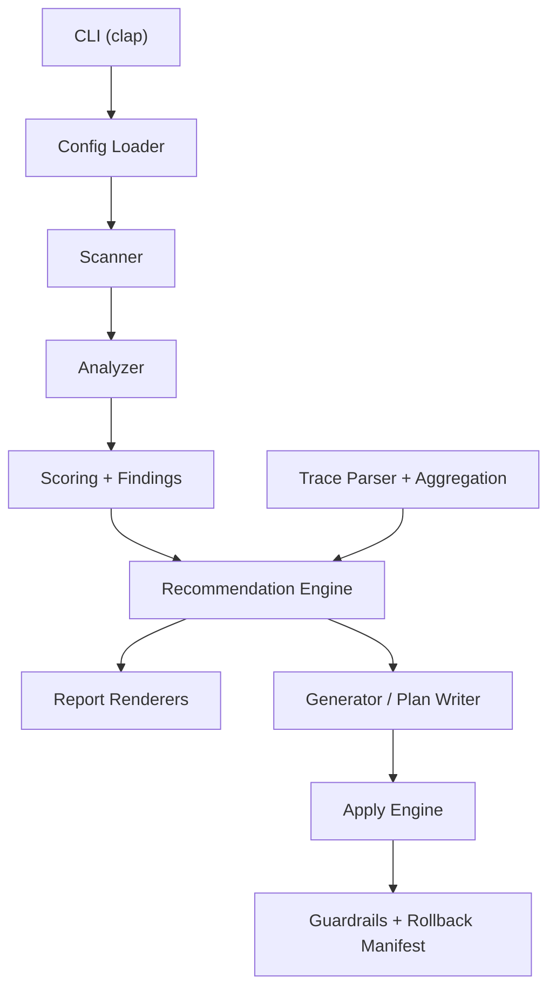

# Harness Architecture

## 1. Scope

`harness` is a single-binary Rust CLI (`harness`) that evaluates and improves repository harnesses for AI agents.  
The system is intentionally deterministic: same input repository + same config should produce stable findings and recommendation ordering.

## 2. Architectural goals

1. Keep core analysis read-only and reproducible.
2. Separate discovery, scoring, recommendation, and write/apply phases.
3. Treat policy enforcement (guardrails, lifecycle, forbidden commands) as first-class.
4. Preserve rollback and reviewability for every write path.
5. Close the loop with trace-driven optimization.

## 3. Runtime shape

## 4. Layered components

### 4.1 CLI and orchestration
- Entry points: `src/main.rs`, `src/cli.rs`
- Responsibilities:
  - Parse command-line arguments
  - Resolve command-specific execution paths
  - Normalize exit codes and top-level error rendering
  - Emit continuity runtime records for command lifecycle

### 4.2 Configuration
- Entry points: `src/config.rs`, `src/types/config.rs`
- Responsibilities:
  - Load global, repository, and local override config
  - Validate profiles, tool lifecycle fields, and metric weights
  - Produce a typed `HarnessConfig` consumed by command handlers
- Merge order:
  1. Global config
  2. Repo config
  3. Local override

### 4.3 Discovery and repository model
- Entry points: `src/scan/*`
- Responsibilities:
  - Filesystem inventory
  - Docs/context presence checks
  - Tooling signatures
  - Git metadata and repo health signals
- Output:
  - Normalized repository snapshot used by analysis modules

### 4.4 Analysis and scoring
- Entry points: `src/analyze/*`, `src/types/scoring.rs`
- Responsibilities:
  - Compute category scores (context, tools, continuity, verification, quality)
  - Emit deterministic findings with severity and evidence anchors
  - Feed optimizer with score/finding structures

### 4.5 Recommendation and optimization
- Entry points: `src/optimization/*`
- Responsibilities:
  - Convert findings + scores into ordered recommendation sets
  - Apply profile-driven thresholds and rules
  - Use trace data to refine priority and suppress low-value changes
  - Preserve deterministic order in equal-score cases

### 4.6 Generation and apply
- Entry points: `src/generator/*`
- Responsibilities:
  - Materialize plans and patch candidates
  - Enforce apply preconditions
  - Create rollback manifests before modifications
  - Write updated files through a controlled writer path

### 4.7 Guardrails and policy
- Entry points: `src/guardrails/*`
- Responsibilities:
  - Validate command/tool usage against policy
  - Resolve aliases prior to matching
  - Enforce deprecation lifecycle:
    - `observe`: non-blocking finding
    - `deprecated`: blocking finding
    - `disabled`: hard policy block for apply/guardrails
  - Detect risky loops and unsafe command patterns

### 4.8 Trace ingestion and continuity
- Entry points: `src/trace/*`, `src/continuity.rs`
- Responsibilities:
  - Parse trace inputs
  - Aggregate failure classes and command patterns
  - Provide optimization signal
  - Persist command lifecycle logs with rotation/batching controls

### 4.9 Reporting
- Entry points: `src/report/*`
- Formats:
  - Markdown
  - JSON
  - SARIF
- Responsibilities:
  - Keep report schema stable
  - Preserve evidence references for auditability

## 5. Command-level execution contracts

### `init`
- Creates scaffold artifacts required by selected profile.
- Must be idempotent for existing files unless explicitly overwritten.

### `analyze`
- Read-only path.
- Returns score + findings + recommendations in selected format.

### `suggest`
- Read-only path.
- Returns ordered recommendation candidates.

### `apply`
- Writes changes from plan input.
- Preconditions:
  1. Working tree cleanliness check (unless override enabled)
  2. Plan source validation (`--plan-file` xor `--plan-all`)
  3. Policy/guardrail checks
  4. Rollback manifest creation
  5. Optional confirmation gate unless non-interactive flags are provided

### `optimize`
- Consumes traces/metrics and emits refined recommendation output.
- Uses config thresholds to gate weak statistical signals.

### `bench`
- Produces benchmark data and optional compare output.
- Compare mode enforces environment guardrails unless `--force-compare` is used.

### `lint`
- Verifies harness profile conformance and policy compliance.
- Exit behavior:
  - `0` clean
  - `1` warnings
  - `2` blocking violations
  - `3` runtime/fatal error

## 6. Core data contracts

### 6.1 Report contract
- `overall_score`
- `category_scores`
- `findings`
- `recommendations`

### 6.2 Plan contract
- plan identity and metadata (`id`, `title`, `goal`)
- risk/impact/effort fields
- command and patch instructions

### 6.3 Trace contract
- task identity
- tool invocation sequence
- failure classes
- elapsed/runtime signals

## 7. Reliability model

- Deterministic recommendation ordering to avoid plan churn.
- Strict config validation to fail fast on unknown/invalid fields.
- Defensive parse handling for traces and config overlays.
- Rollback-first strategy for write paths.
- Guardrail checks before apply operations.

## 8. Testing strategy

- Unit tests in `src/*` modules for core logic and parsing.
- Integration tests in `tests/integration.rs` for multi-module behavior.
- CLI ATDD scenarios in `tests/cli_atdd.rs` for end-to-end command behavior and error paths.
- TDD-first additions on critical logic, ATDD additions for user-facing flow regressions.

## 9. Extensibility points

- Add new analysis dimensions by:
  1. introducing module logic under `src/analyze/`
  2. extending score/report types in `src/types/`
  3. wiring recommendation rules in `src/optimization/`
  4. adding unit + CLI coverage
- Add new report format by:
  1. implementing renderer under `src/report/`
  2. adding CLI format mapping
  3. adding golden-style output tests

## 10. Reference documents

- Project structure map: `docs/CODE_STRUCTURE.md`
- Installation and operations: `docs/INSTALLATION.md`
- Product and implementation phases: `PLAN.md`
