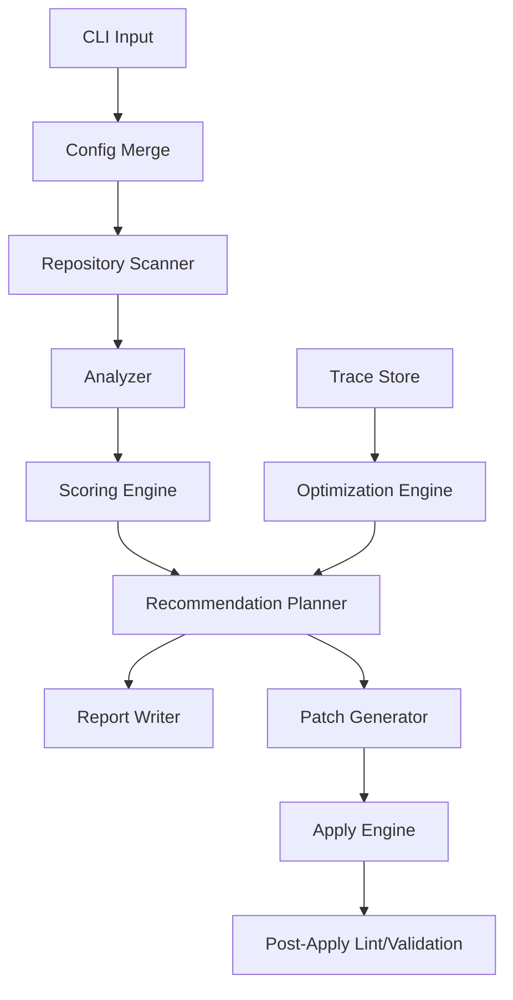
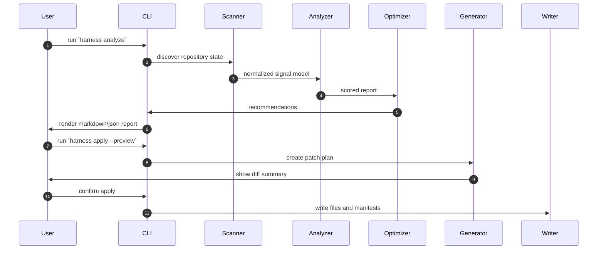

# Harness Architecture

## 1. Purpose

`harness` is a Rust CLI that analyzes a repository and emits an agent-optimized harness profile. It focuses on reducing tool sprawl, improving agent legibility, enforcing continuity, and continuously tuning behavior through traces.

## 2. Principles

1. Start from minimal viable tools.
2. Keep guidance file-based and versioned in-repo.
3. Prefer deterministic, auditable harness rules over opaque runtime heuristics.
4. Make long-running work resumable via explicit state artifacts.
5. Optimize iteratively from measured traces.

## 3. High-level flow

## 4. Modules and responsibilities

### CLI layer
- `main.rs` and `cli.rs` parse commands and dispatch.
- Maps user intent into one of: `init`, `analyze`, `suggest`, `apply`, `optimize`, `bench`, `lint`.

### Configuration
- `config.rs` and `types/config.rs` handle layered config loading.
- Merge order: global config -> repo config -> local overrides.

### Discovery / scanning
- `scan/` modules inspect repository structure and metadata.
- Inputs: file inventory, docs presence, existing harness files, git metadata.

### Analysis
- `analyze/` computes deterministic signals and sub-scores:
  - context quality,
  - tool set health,
  - continuity/readiness,
  - verification readiness,
  - repo architecture quality.

### Optimization
- `optimization/` converts scores into change plans.
- Rule-based and profile-driven with confidence + impact classification.

### Generation
- `generator/` renders patch-level outputs from templates.
- Produces harness manifest, prompt stubs, and workflow artifacts.

### Trace feedback
- `trace/` ingests run traces, aggregates failures and progress,
  then feeds harness suggestions to optimization rules.

### Reporting
- `report/` renders Markdown/JSON/SARIF outputs.

### Guardrails
- `guardrails/` handles command policy checks and loop detection signals.

## 5. Command contracts

- `init`: create initial scaffold if absent.
- `analyze`: read-only diagnostics and score report.
- `suggest`: return ranked change plan.
- `apply`: emit or apply patches in dry-run/approve modes.
  - **Preconditions (5-step sequence):**
    1. Clean working tree check (unless `--allow-dirty`)
    2. Plan file validation (exists, parses, no path traversal, version match)
    3. Rollback manifest creation (`.harness/rollback/<timestamp>.json`)
    4. Change scope summary (modified/created/deleted file counts)
    5. Confirmation prompt (`y/N`, skipped with `--yes` or in preview mode)
  - **Selector:** Exactly one of `--plan-file <path>` or `--plan-all` is required (mutually exclusive).
- `optimize`: compare harness revisions using trace and benchmark deltas.
- `bench`: run benchmark suite and capture run metrics.
- `lint`: verify conformance to selected harness profile.
  - Checks required files exist per active profile.
  - Validates tool configurations against forbidden/deprecated policy.
  - Returns exit code 2 for blocking violations, 1 for warnings, 0 for clean.

## 6. Data contracts (core)

### Harness report
- `overall_score`: weighted composite.
- `category_scores`: context / tools / continuity / verification / quality.
- `findings`: issues with file references and line hints when available.
- `recommendations`: ordered list with confidence and risk.

### Change plan
- `id`, `title`, `goal`, `risk`, `impact`, `effort`, `commands`, `patches`.

### Trace summary
- task ids, failures by class, tool call sequence, elapsed time, pass/fail.

## 7. Data flow details

## 8. Security model

- baseline deny list for destructive/system commands.
- explicit opt-in for privileged actions.
- dry-run default for changes.
- no implicit writes in analyze/suggest modes.
- **Tool deprecation lifecycle:** 3-phase (observe → deprecated → disabled) managed via `[tools.deprecated]` config. See PLAN.md §5.2 for phase behavior.
- **Alias expansion:** command policy resolves aliases before matching (e.g., `grep` → `rg`).
- **Apply rollback:** every `apply` creates a rollback manifest with SHA256 hashes before any file modification.

## 9. Exit behavior

- 0: success with no blocking issues
- 1: success with warnings
- 2: blocking issues or policy violations
- 3: runtime/fatal execution error

## 10. Delivery milestone path

- M1: scanning + analyze command.
- M2: recommendation engine + suggest.
- M3: safe apply with patch preview.
- M4: trace ingestion + optimize loops.

See PLAN.md Section 17 for the week-by-week execution timeline mapping to these milestones.
