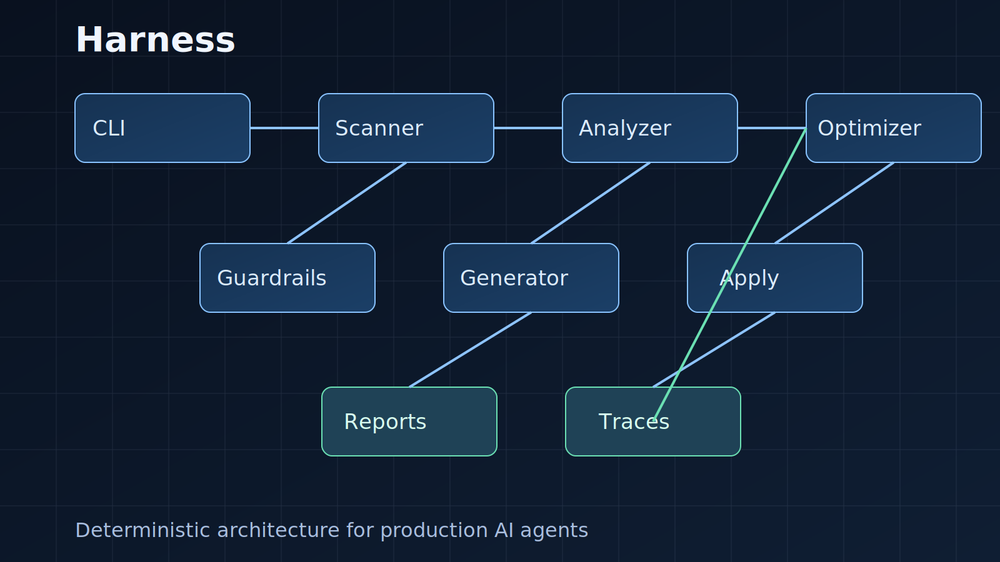

# Harness

`harness` is a Rust CLI that analyzes and hardens AI-agent harnesses in a repository.  
It focuses on:
- toolset minimization and policy enforcement,
- continuity for long-running agent tasks,
- deterministic quality and verification signals,
- safe, reviewable change planning and apply flows.



## Status

`harness` is in active development. Core commands are implemented and covered with unit tests, integration tests, and CLI ATDD scenarios.

Current lifecycle behavior for `tools.deprecated`:
- `observe`: warning finding (`tools.observe`), non-blocking.
- `deprecated`: blocking lint finding (`tools.deprecated`).
- `disabled`: promoted into `tools.baseline.forbidden` on `apply --apply-mode apply`; still forbidden in apply/guardrails.

## Requirements

- Rust stable toolchain (Cargo + rustc)
- Git
- POSIX shell (`bash`) for `scripts/install.sh`

## Installation

Recommended:

```bash
git clone git@github.com:mudrii/harness.git
cd harness
./scripts/install.sh --method path --force
```

Alternative (direct git install through Cargo):

```bash
./scripts/install.sh --method git --repo-url https://github.com/mudrii/harness --force
```

Manual install without script:

```bash
cargo install --path . --locked --force
```

Detailed installation guide and troubleshooting: `docs/INSTALLATION.md`.

## Quick start

```bash
harness analyze /path/to/repo --format markdown
harness suggest /path/to/repo --format json
harness apply /path/to/repo --plan-file .harness/plans/latest.json --apply-mode preview
harness lint /path/to/repo
```

## Command overview

- `harness init`: bootstrap harness scaffold files
- `harness analyze`: produce diagnostics and category scoring
- `harness suggest`: produce ranked recommendations
- `harness apply`: preview/apply generated plans with rollback manifests
- `harness optimize`: optimize recommendations based on traces
- `harness bench`: run benchmark/compare workflows with guardrails
- `harness lint`: enforce harness profile and policy conformance

## Documentation

- Agent first-read guide: `AGENT_README.md`
- Mandatory agent context pack:
  - `AGENT_README.md`
  - `CONTRACTS.md`
  - `TEST_STRATEGY.md`
  - `REPO_MAP.json`
  - `ERROR_CATALOG.json`
- Optional/on-demand docs:
  - `ARCHITECTURE.md`
  - `docs/CODE_STRUCTURE.md`
  - `docs/CLI_SIMULATION.md`
  - `PLAN.md`
  - `COMMAND_EXAMPLES.md`
  - `TEST_MATRIX.md`
- Architecture: `ARCHITECTURE.md`
- Code structure map: `docs/CODE_STRUCTURE.md`
- Installation and upgrade: `docs/INSTALLATION.md`
- Product and implementation plan: `PLAN.md`

> For any agent-driven development in this repository, start with the mandatory context pack above.
> Behavioral truth should come from tests and simulation:
> `tests/cli_atdd.rs` and `scripts/simulate_cli_use_cases.sh`.

## Development

```bash
cargo check --all-targets
cargo test
cargo clippy --all-targets
```

## License

MIT. See `Cargo.toml` for package metadata.
